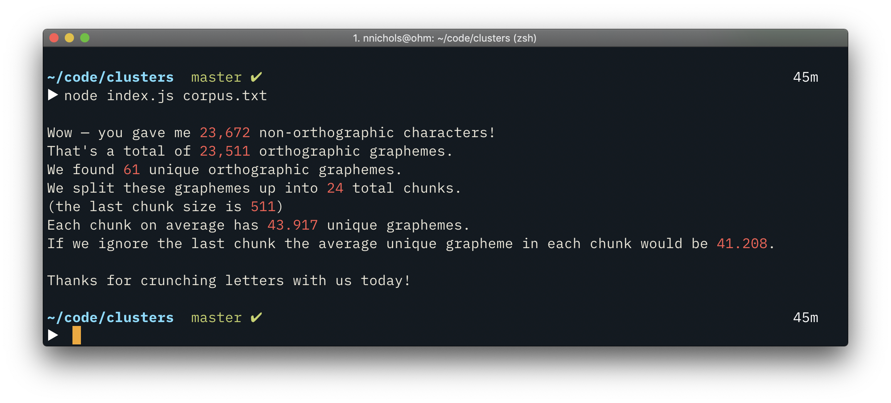

# Corpus Grapheme Chunk Averages

We use the grapheme-splitter library to create an array of orthographic graphemes. 

Then we create an array of arrays — chunks of 1000 graphemes each. 

Then we create sets of unique graphemes for each chunk.

Then we calculate the average unique grapheme count in each set (with and without the final chunk (likely smaller)).

`npm install`

`node index.js corpus.txt`
